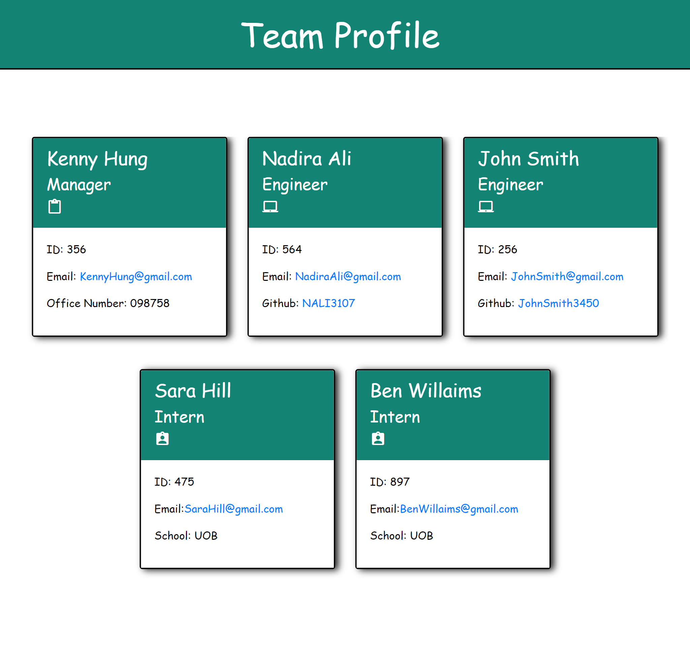
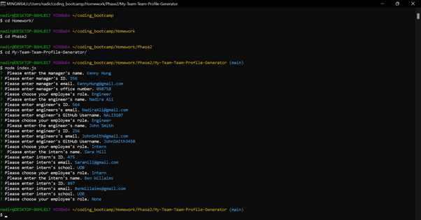
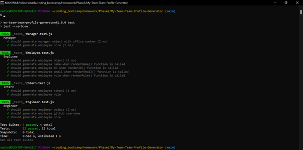

# Team-Profile-Generator

## Table of Contents

- [Description](#description)
- [Installation](#installation)
- [Usage](#usage)
- [Generated-TeamProfile-Example](#examples)
- [Contact Information](#contact)

## Description

This is a Node.js command-line application that takes in information about employees on a software engineering team, then generates an HTML webpage that displays summaries for each person.

## Installation

- node.js needs to be installed prior to use
- open terminal
- clone the repo: `https://github.com/NAli3107/My-Team-Team-Profile-Generator`
- cd into new directory
- download JSON packages by entering `npm i`
- enter `node index.js`
- follow prompts

## Usage

A command-line application that accepts user input is created when a user is prompted for their team members and their information. Then a HTML file is generated that displays a nicely formatted team roster based on user input. 

When a user clicks on an email address in the HTML then the default email program opens and populates the TO field of the email with the address. 

When a user click on the GitHub username then that GitHub profile opens in a new tab. 

When the user starts the application then they are prompted to enter the team manager’s name, employee ID, email address, and office number.

Next the user is presented with a menu with the option to add an engineer or an intern or to finish building their team. 

If they select the engineer option, then they are prompted to enter the engineer’s name, ID, email, and GitHub username, and I am taken back to the menu. 

When they select the intern option, then they are prompted to enter the intern’s name, ID, email, and school, and they are taken back to the menu.

Finally, when they decide to finish building their team, then they exit the application, and the HTML is generated.

```
Below is an explanatory video about how to use the application Follow the steps to dynamically generate your team profile.
```

[Team Profile Generator Video Link](https://drive.google.com/file/d/1ShHhzcSP7BSBHyGoD7sp13sWl4YCHyJs/view)


## Examples

Screenshot of Application:



Team Profile Generator GIF:


Screenshot of Terminal 1:



Screenshot of Terminal 2:




## Contact

Email Address: Nadiraali188a@gmail.com

Linkedin Profile: [LinkedIn](https://www.linkedin.com/in/nadira-ali-09a182106/)

Github: [Profile](https://github.com/NAli3107)

Github: [Repo](https://github.com/NAli3107/My-Team-Team-Profile-Generator)
